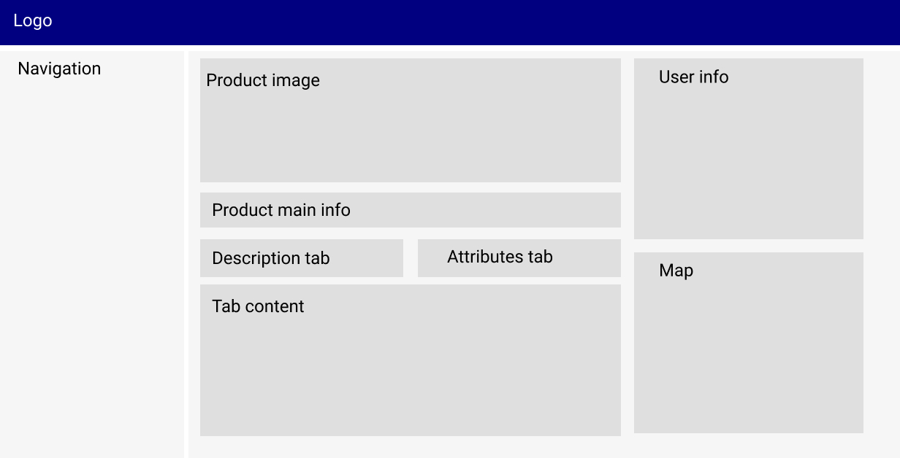

# Instructions
Please stick to the following instructions on how to submit your application:
1. Read the **whole** README
2. Create a new repository on your Github Account. *Note: The repository has to be public.*
3. Add your solution **with all requirements** to your repository
4. Send a mail to application@innoloft.com with following information: 
   * Your Name
   * Link to **public** accessable repository on **GitHub**
   * How many hours it took to complete (roughly)

**Please do not spend much more than 6 hours for the whole task.** This is not a hard limitation but want to respect your time since we cannot hire every applicant.

Additional Information to submit a successful application:
- Make sure that your repository is public
- Only an application with all requirements can be considered
- Provide setup process if required
- Copied structures or code from other applications will be completely ignored

Thank you very much and have fun with the challenge!

# Main Task
Your task is to create a new dashboard with which you will be displaying and editing product information.

First you have to setup the main dashboard with the main structure:
- Header with [Innoloft Logo](https://img.innoloft.com/logo.svg)
- Navigation
  - Main Page
  - Product

This structure will be the same on all pages.

It's not required that the main page has any content. **But it should be the default page on the root path `/`.**

## Product Page (`/product`)
- Product image
- Product main info should contain
  - title
  - type
- 2 tab buttons to switch/change the tab content
  - Description
  - Attributes
- Description tab should contain product description
- Attributes tab should contain:
  - categories (name only)
  - business models (name only)
  - [TRL](https://en.wikipedia.org/wiki/Technology_readiness_level)
- User info should contain:
  - user image
  - user name
  - user company name
- Map should display company address of the product

## Editing Product
It should be possible to change the description, edit the attributes as well as add new ones. The categories and business-models should be editable with a simple text input and the TRL with a dropdown. For editing the description follow the WYSIWYG methodology.  
When saving the product a PUT request has to be made to the API. Please keep in mind that the API itself **will not save your request**.
### Example Mockup


# White-Labeling
In this step you will have to apply different configurations to the dashboard. Here you will have to add environment variables (f.e. with a `.env` file). Depending on the `APP_ID` environment variable. If **no** `.env` file is given, make sure to add a fallback to `APP_ID=1`.
A configuration will look like that:
```json
{
    "id": 1,
    "logo": "img.innoloft.de/logo.svg",
    "mainColor": "#272e71",
    "hasUserSection": true
}
```
With the api call `/configuration/:appId/` you get the configuration for your `APP_ID`. Possible appIds are `1` and `2`.
* In case `hasUserSection: false` - hide the user info section on the right.
* Apply main color to header and other elements to your taste

# API
In the task you will need to fetch some data from an API. The API base url is `https://api-test.innoloft.com`.  
Please use **exactly** these endpoints:
- Product
  - GET `/product/6781/`
  - PUT `/product/6781/`
- TRL List
  - GET `/trl/`
- APP Configuration
  - GET `/configuration/:appId/`

You can also download the [Postman collections](https://api-test.innoloft.com/postman_collection.json).  
*Note: If you have CORS issues, there must be something wrong on your end. Check the exact paths again.*
# Technical Requirements

The application should at the very least use the following:

- JavaScript **or** TypeScript
- React.js
- Redux
- CSS
  - Your own CSS structure **or** Tailwind CSS (do not use any other CSS frameworks)
  - A CSS pre-compiler (SASS, LESS, SCSS) or other CSS approaches (CSS modules, Styled components)
- The dashboard should be responsive. It should **be usable on mobile and tablets**. There are no mockups for mobile and table views, adapt it to your taste.
- (Optional) Linter
- (Optional) Prettier

When styling, you can decide for yourself what this dashboard should look like (even the structure-wise), make it look as nice as you can. If you need some inspiration, you can check out this [style guide](https://img.innoloft.com/pdf/styleguide_innoloft.pdf).
